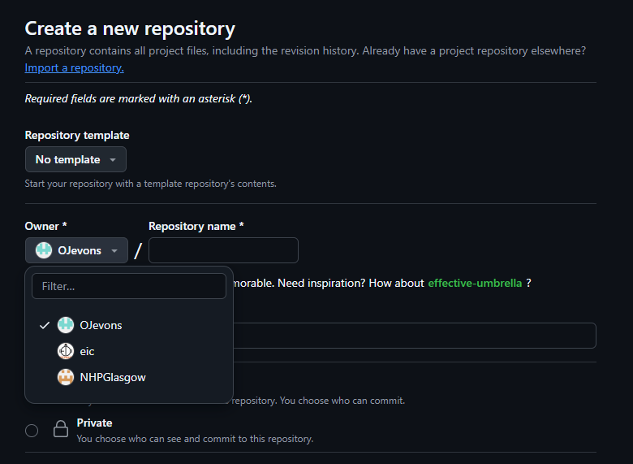
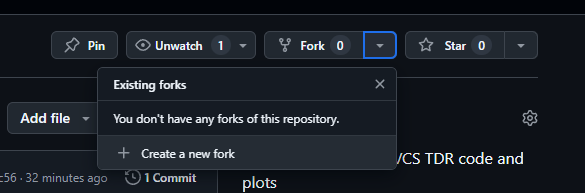
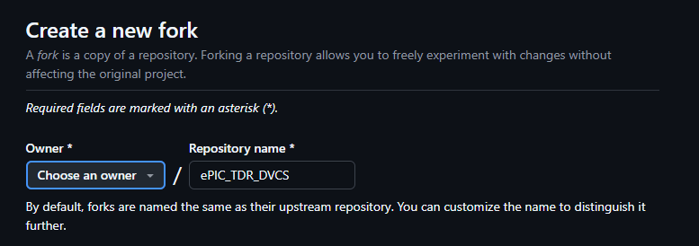

# How Tos/FAQ's

## Adding repositories to NHPGlasgow organisation

There are a few methods by which a repository can be added to the NHPGlasgow organisation page.

### 1. Direct ownership

When creating a new repository through the GitHub web interface, any user can change the repository's owner to be any organisation that they are a part of. Click on the dropdown menu under the "Owner *" text, and pick the desired organisation, as in the image below.

### 2. Forking

If the repository has already been created, then a user can instead create a new fork of the repository and set the organisation as the new fork's owner.

